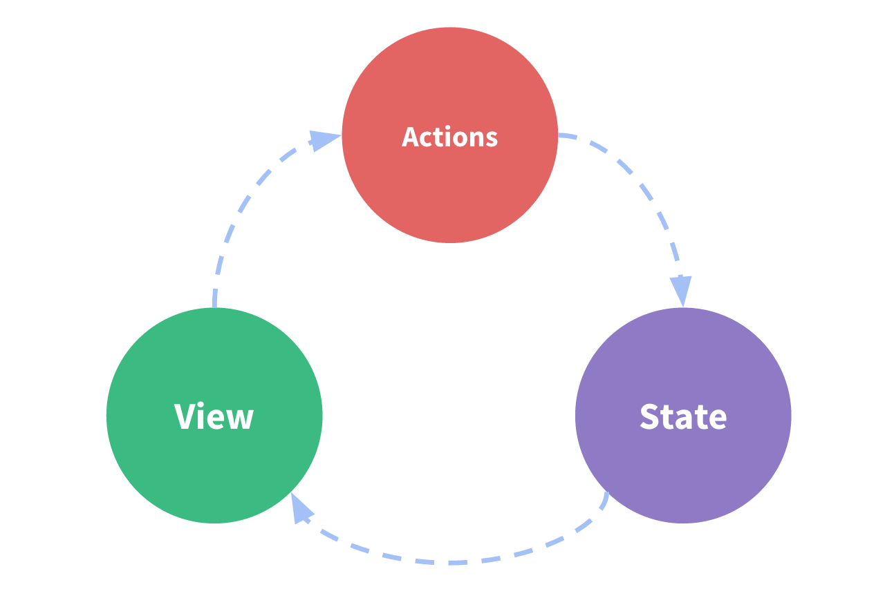

# Что такое Vuex?

Vuex — это **паттерн управления состоянием и библиотека** для приложений на Vue.js. Он служит центральным хранилищем данных для всех компонентов приложения и обеспечивает предсказуемость изменения данных при помощи определённых правил. Кроме того, Vuex интегрируется с официальным [расширением инструментов разработчика](https://github.com/vuejs/vue-devtools) Vue, предоставляя "из коробки" такие продвинутые возможности, как "машину времени" при отладке и экспорт/импорт слепков состояния данных.

### Что такое "паттерн управления состоянием"?

Давайте начнём с простого приложения, реализующего счётчик с использованием Vue:

``` js
new Vue({
  // состояние
  data () {
    return {
      count: 0
    }
  },
  // представление
  template: `
    <div>{{ count }}</div>
  `,
  // действия
  methods: {
    increment () {
      this.count++
    }
  }
})
```

Это самостоятельное приложение состоит из следующих частей:

- **Состояние** — "источник истины", управляющий приложением;
- **Представление** — декларативно заданное отображение **состояния**;
- **Действия** — возможные пути изменения состояния приложения в ответ на взаимодействие пользователя с **представлением**.

Вот простейшее представление концепции "однонаправленного потока данных":

<p style="text-align: center; margin: 2em">
  
</p>

Простота, к сожалению, быстро исчезает при появлении **нескольких компонентов, основывающихся на одном и том же состоянии**, когда:

- Несколько представлений могут зависеть от одной и той же части состояния приложения
- Действия из разных представлений могут оказывать влияние на одни и те же части состояния приложения

Разбираясь с первой проблемой, вам придётся передавать одни и те же данные в несколько глубоко вложенных компонентов. Это часто сложно и неприятно, а для соседних компонентов такое и вовсе не сработает. Решая вторую проблему, приходится обращаться напрямую к родителям и потомкам компонента, или синхронизировать изменения с другими местами в приложении событиями. Оба подхода хрупки и быстро приводят к появлению кода, который невозможно поддерживать.

Так почему бы не вынести всё общее состояние приложения из компонентов в глобальный синглтон? При использовании этого подхода, дерево компонентов превращается в одно большое "представление", а каждый компонент получает доступ к состоянию приложения, наряду с возможностью вызывать действия для изменения состояния, независимо от расположения этого компонента в дереве.

Кроме того, чётко определяя и разделяя концепции, возникающие при управлении состоянием, и требуя соблюдения некоторых правил, мы улучшаем структурированность и поддерживаемость нашего кода.

Такова основная идея, лежащая в основе Vuex, вдохновлённого [Flux](https://facebook.github.io/flux/docs/overview), [Redux](http://redux.js.org/) и [Архитектурой Elm](https://guide.elm-lang.org/architecture/). В отличие от других паттернов, Vuex реализован в виде библиотеки, специально заточенной на использование совместно с Vue.js и использующей его производительную систему реактивных обновлений.


### В каких случаях следует использовать Vuex?

Vuex помогает управлять совместно используемым состоянием ценой привнесения новых концепций и вспомогательного кода. Кратковременная продуктивность страдает во благо долгосрочной.

Если вам ещё не доводилось создавать крупномасштабные одностраничные приложения, Vuex может показаться многословным и обескураживающим. Это нормально — несложные приложения вполне могут обойтись и без Vuex. Возможно, вам вполне хватит простой [глобальной шины событий](https://ru.vuejs.org/v2/guide/components.html#Коммуникация-между-компонентами-не-связанными-иерархически). Но если вы создаёте SPA среднего или крупного размера, вероятно вам уже приходилось сталкиваться с ситуациями, заставляющими задуматься о методах более эффективного управления состоянием приложения за пределами компонентов Vue, и Vuex в таком случае может оказаться вполне естественным следующим шагом. Вот неплохая цитата от Дэна Абрамова, автора Redux:

> Flux-библиотеки подобны очкам: если они вам действительно нужны, вы на этот счёт не сомневаетесь.
