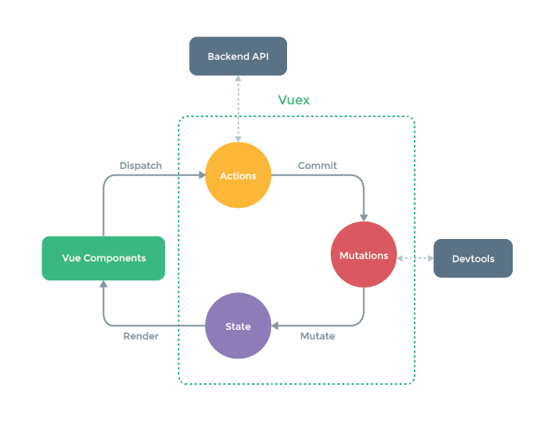

# Was ist Vuex?

Vuex ist eine **Vorlage und Bibliothek für State-Management** (Organisation von Zuständen) für Apps in Vue.js. Es dient als eine zentralisierte Ablage mit festgelegten Regeln für alle Komponenten einer App, zB. dass State nur auf bestimmte Art und Weise verändert werden darf.

Es ist auch Teil von Vues offizieller [DevTools-Erweiterung](https://github.com/vuejs/vue-devtools), um erweiterte Features wie konfigurationsfreies, zeitreisendes Debugging und Import/Export von State-Snappshots (Schnappschüsse) zu ermöglichen.


### Was ist eine "State-Management-Vorlage"?

Beginnen wir mit einer simplen Counter-App in Vue:

``` js
new Vue({
  // State
  data () {
    return {
      count: 0
    }
  },
  // View
  template: `
    <div>{{ count }}</div>
  `,
  // Actions
  methods: {
    increment () {
      this.count++
    }
  }
})
```

Es ist eine in sich geschlossene App bestehenden aus folgenden Teilen:

- Der **State** (Zustand), welcher die [Source of Truth (Quelle der Wahrheit)](https://de.wikipedia.org/wiki/SPOT_(Datenmanagement) ist.
- Der **View** (Ansicht), welcher lediglich eine deklarative Verbindung zum State darstellt.
- Die **Actions** (Aktionen), welche die Möglichkeit bieten den State anhand von Benutzerinteraktionen zu ändern.

Dies ist eine extrem einfache Form des Konzepts des **one-way Data Flows** (einseitiger Datenfluss):

<p style="text-align: center; margin: 2em">
  
</p>

Allerdings fällt diese Einfachheit schnell in sich zusammen, wenn **mehrere Komponenten vorhanden sind, die den gleichen State teilen:**

- Mehrere Views können abhängig vom gleichen Teil des States sein.
- Actions aus verschiedenen Views können den gleichen Teil des States verändern.

Zum ersten Problem sei gesagt, dass es zwar möglich, aber anstrengend ist Props in tief verschachtelte Komponenten überzugeben und es für Sibling-Komponenten erst gar nicht funktioniert.

Das zweite Problem löst man gern mit direkter Referenz der Parent-/Child-Instanz oder dem Versuch mehrere Kopien des States via Events zu ändern und zu synchronisieren.

Beide Lösungen führen schnell zu schwer instandhaltbaren Code.

Demnach wäre es sinnvoll den von mehreren Komponenten geteilte State zu extrahieren, um es in einer globalen Einheit zu organisieren. Damit wird der Verzeichnisbaum aller Komponenten zu einem großen "View" und jede Komponente hat Zugang zum State und kann Actions auslösen - völlig egal, wo sie sich befinden!

Darüberhinaus wird durch Definition und Aufteilung der Konzepte, welche den State-Management und das Festlegen bestimmter Regeln ausmachen, der Code wesentlich übersichtlicher und einfacher instand zu halten.


Das ist die grundlegende Idee hinter Vuex - inspiriert durch [Flux](https://facebook.github.io/flux/docs/overview.html), [Redux](http://redux.js.org/) und [The Elm Architecture](https://guide.elm-lang.org/architecture/). Anders als die anderen ist Vuex eine Implementierung, die speziell auf Vue.js zugeschnitten ist und demnach vollen Nutzen des Reaktivitätssystems für effiziente Updates nehmen kann.



### Wann sollte ich es nutzen?

Obwohl Vuex uns bei der Arbeit mit geteiltem State-Management hilft, kommt es auch mit Kosten wie weiterem Konzeptverständnis und mehr Boilerplate. Man muss abwägen zwischen kurzzeitiger und langzeitiger Produktivität.

Solltest du noch nie eine größere SPA (Single Page App) geschrieben haben, kann Vuex langatmig oder gar abschreckend wirken - das ist völlig normal.

Wenn die App simpel aufgebaut ist, wird Vuex womöglich erst gar nicht nötig sein. Ein simpler [Global Event Bus](http://vuejs.org/guide/components.html#Non-Parent-Child-Communication) würde auch reichen.

Wenn es jedoch um mittlere bis große SPAs geht, könnte es gut sein, dass Probleme zum Handhaben des States in Vue-Komponenten auftraten. Hierfür ist Vuex der nächste Schritt.

Ein wunderbares Zitat von Dan Abramov, dem Autor von Redux:

> Flux-Bibliotheken sind wie Brillen: Du weißt Bescheid, wenn du sie brauchst.
