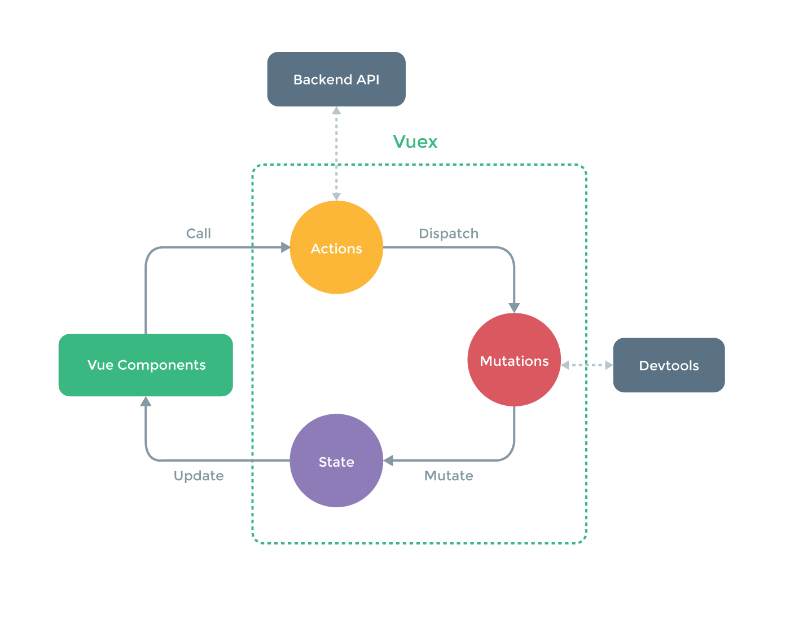

# Data Flow

Let's build a simple counter app with Vuex to get a better understanding of the data flow inside Vuex apps. Note this is a trivial example solely for the purpose of explaining the concepts - in practice you don't need Vuex for such simple tasks.

### The Store

``` js
// store.js
import Vue from 'vue'
import Vuex from 'vuex'

Vue.use(Vuex)

// app initial state
const state = {
  count: 0
}

// define possible mutations
const mutations = {
  INCREMENT (state) {
    state.count++
  },
  DECREMENT (state) {
    state.count--
  }
}

// create the store
export default new Vuex.Store({
  state,
  mutations
})
```

### Actions

``` js
// actions.js
export const increment = ({ dispatch }) => dispatch('INCREMENT')
export const decrement = ({ dispatch }) => dispatch('DECREMENT')
```

### Use It with Vue

**Template**

``` html
<div id="app">
  Clicked: {{ count }} times
  <button v-on:click="increment">+</button>
  <button v-on:click="decrement">-</button>
</div>
```

**Script**

``` js
// We are importing and injecting the store here because
// this is the root. In larger apps you only do this once.
import store from './store'
import { increment, decrement } from './actions'

const app = new Vue({
  el: '#app',
  store,
  vuex: {
    getters: {
      count: state => state.count
    },
    actions: {
      increment,
      decrement
    }
  }
})
```

Here you will notice the component itself is extremely simple: it simply displays some state from the Vuex store (not even owning its own data), and calls some store actions on user input events.

You will also notice the data flow is unidirectional, as it should be in Flux:

1. User input in the component triggers action calls;
2. Actions dispatch mutations that change the state;
3. Changes in state flow from the store back into the component via getters.

<p align="center">
  
</p>
