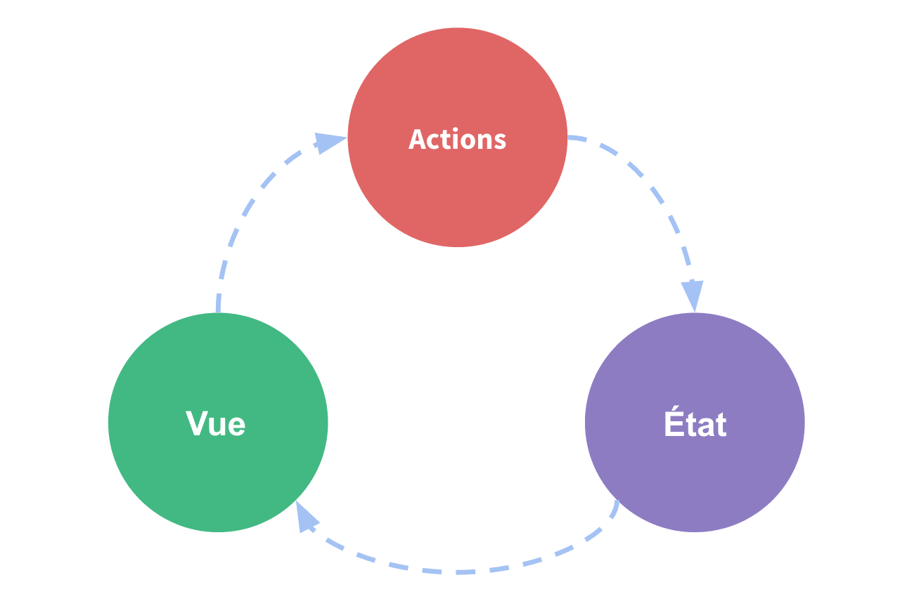
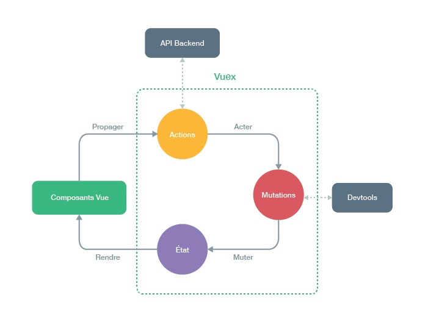

# What is Vuex?

Vuex is a **state management pattern + library** for Vue.js applications. It serves as a centralized store for all the components in an application, with rules ensuring that the state can only be mutated in a predictable fashion. It also integrates with Vue's official [devtools extension](https://github.com/vuejs/vue-devtools) to provide advanced features such as zero-config time-travel debugging and state snapshot export / import.

### What is a "State Management Pattern"?

Let's start with a simple Vue counter app:

``` js
new Vue({
  // state
  data () {
    return {
      count: 0
    }
  },
  // view
  template: `
    <div>{{ count }}</div>
  `,
  // actions
  methods: {
    increment () {
      this.count++
    }
  }
})
```

It is a self-contained app with the following parts:

- The **state**, which is the source of truth that drives our app;
- The **view**, which is just a declarative mapping of the **state**;
- The **actions**, which are the possible ways the state could change in reaction to user inputs from the **view**.

This is an extremely simple representation of the concept of "one-way data flow":

<p style="text-align: center; margin: 2em">
  
</p>

However, the simplicity quickly breaks down when we have **multiple components that share common state**:

- Multiple views may depend on the same piece of state.
- Actions from different views may need to mutate the same piece of state.

For problem one, passing props can be tedious for deeply nested components, and simply doesn't work for sibling components. For problem two, we often find ourselves resorting to solutions such as reaching for direct parent/child instance references or trying to mutate and synchronize multiple copies of the state via events. Both of these patterns are brittle and quickly lead to unmaintainable code.

So why don't we extract the shared state out of the components, and manage it in a global singleton? With this, our component tree becomes a big "view", and any component can access the state or trigger actions, no matter where they are in the tree!

In addition, by defining and separating the concepts involved in state management and enforcing certain rules, we also give our code more structure and maintainability.

This is the basic idea behind Vuex, inspired by [Flux](https://facebook.github.io/flux/docs/overview.html), [Redux](http://redux.js.org/) and [The Elm Architecture](https://guide.elm-lang.org/architecture/). Unlike the other patterns, Vuex is also a library implementation tailored specifically for Vue.js to take advantage of its granular reactivity system for efficient updates.



### When Should I Use It?

Although Vuex helps us deal with shared state management, it also comes with the cost of more concepts and boilerplate. It's a trade-off between short term and long term productivity.

If you've never built a large-scale SPA and jump right into Vuex, it may feel verbose and daunting. That's perfectly normal - if your app is simple, you will most likely be fine without Vuex. A simple [global event bus](http://vuejs.org/v2/guide/components.html#Non-Parent-Child-Communication) may be all you need. But if you are building a medium-to-large-scale SPA, chances are you have run into situations that make you think about how to better handle state outside of your Vue components, and Vuex will be natural next step for you. There's a good quote from Dan Abramov, the author of Redux:

> Flux libraries are like glasses: you’ll know when you need them.
