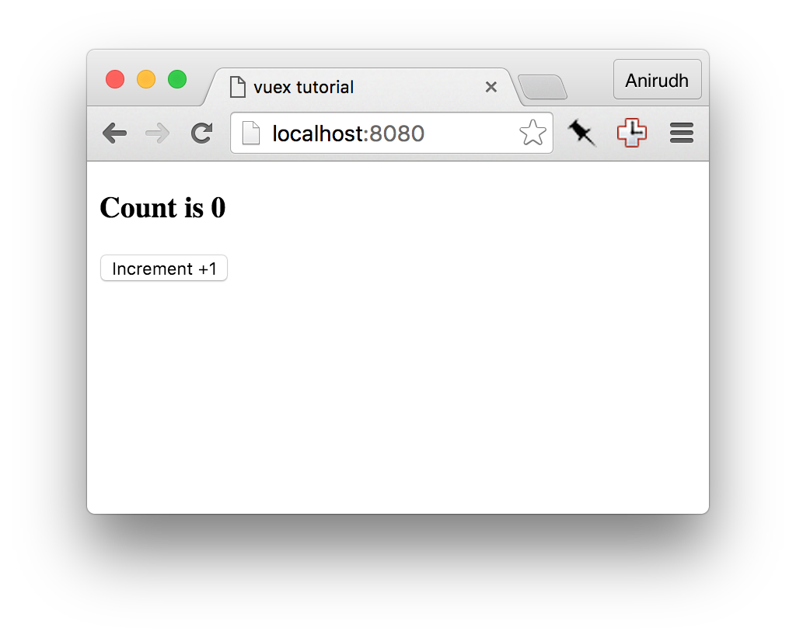
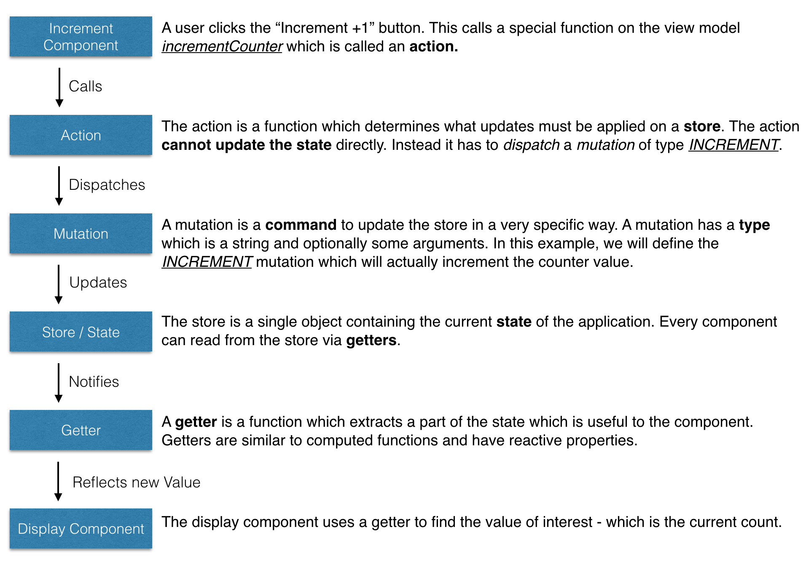

# Tutorial

Let's build a very simple app which will demonstrate the various parts of vuex and how they work together. For this example we're building an app where you press a button and it increments a counter. 



We are using this simple example to explain the concept and the problem vuex aims to solve - how to manage a large app which uses several components. Consider if this example used three components:

### `components/App.vue`

The main app which contains two other child components: 

* `Display` to display the current counter value.
* `Increment` which is a button to increment the current value.

```html
<template>
  <div>
    <Display></Display>
    <Increment></Increment>
  </div>
</template>

<script>

import Display from "./Display.vue"
import Increment from "./Increment.vue"

export default {
  components: {
    Display,
    Increment
  }
}
</script>
```

### `components/Display.vue`

```
<template>
  <div>
    <h3>Count is 0</h3>
  </div>
</template>

<script>
export default {
}
</script>
```

### `components/Increment.vue`

```
<template>
  <div>
    <button>Increment +1</button>
  </div>
</template>

<script>
export default {
}
</script>
```

### Challenges

* `Increment` and `Display` aren't aware of each other and cannot pass messages to each other.
* `App` will have to use events and broadcasts to coordinate the two components.
* Since `App` is coordinating between the two components, they are not re-usable and tightly coupled. Re-structuring the app might break it

### Vuex "flow"

These are the steps that take place in order:



This might seem a little excessive for incrementing a counter. But do note that these concepts work well in larger applications and improve maintainability and make your app easier to debug and improve in the long run. So let's modify our app to use vuex.

### Step 1: Add a store

First, install vuex via npm:

```
$ npm install --save vuex
```

Create a new file in `vuex/store.js`

```js
import Vue from 'vue'
import Vuex from 'vuex'

// Make vue aware of vuex
Vue.use(Vuex)

// We create an object to hold the initial state when
// the app starts up
const state = {
  // TODO: Set up our initial state
}

// Create an object storing various mutations. We will write the mutation
const mutations = {
  // TODO: set up our mutations
}

// We combine the intial state and the mutations to create a vuex store.
// This store can be linked to our app.
export default new Vuex.Store({
  state,
  mutations
})
```

We need to make our app aware of this store. To do this we simply need to modify our root component.

Edit `components/App.vue` and add the store.

```js
import Display from "./Display.vue"
import Increment from "./IncrementButton.vue"
import store from '../vuex/store' // import the store

export default {
  components: {
    Display,
    Increment
  },
  store: store // make this and all child components aware of the new store
}
```

### Step 2: Set up the action

Create a new file in `vuex/actions.js` with a single function `incrementCounter`

```
// An action will recieve the store as the first argument.
// Since we are only interested in the dispatch (and optionally the state)
export const incrementCounter = function ({ dispatch, state }) {
  dispatch('INCREMENT', 1)
}
```

And let's call the action from our `components/Increment.vue` component.

```
<template>
  <div>
    <button @click="increment">Increment +1</button>
  </div>
</template>

<script>
import { incrementCounter } from "../vuex/actions"
export default {
  vuex: {
    actions: {
      increment: incrementCounter
    }
  }
}
</script>
```

Notice some interesting things about what we just added.

1. We have a new object `vuex.actions` which includes the new action
2. We didn't specify which store, object, state etc. Vuex wires everything up for us.
3. We can call the action either by using `this.increment()` in any method.
4. We can also call the action using the `@click` parameter making `increment` like any regular vue component method.
5. The action is called `incrementCounter` but we can use any name which is appropriate.

### Step 3: Set up the state and mutation

In our `vuex/actions.js` file we dispatch an `INCREMENT` mutation but we haven't written how to handle it yet. Let's do that now.

Edit `vuex/store.js`

```js
const state = {
  // When the app starts, count is set to 0
  count: 0
}

const mutations = {
  // A mutation recieves the current state as the first argument
  // You can make any modifications you want inside this function
  INCREMENT (state, amount) {
    state.count = state.count + amount
  }
}
```

### Step 4: Get the value into the component

Create a new file called `vuex/getters.js`

```
// This getter is a function which just returns the count
export const getCount = function (state) {
  return state.count
}
```

This is a simple function which just returns a subset of the state object which is of interest for us, which is the current count. Now we need to use this getter to actually fetch the data in the component.

Edit `components/Display.vue`

```html
<template>
  <div>
    <h3>Count is {{ counterValue }}</h3>
  </div>
</template>

<script>
import { getCount } from "../vuex/getters"
export default {
  vuex: {
    getters: {
      counterValue: getCount
    }
  }
}
</script>
```

There's a new object `vuex.getters` which requests `counterValue` to be bound to the getter `getCount`. We've chosen different names to demonstrate that you can use the names that make sense in the context of your component, not necessarily the getter name itself.

You might be wondering, why is it preferable to use a getter instead of using something like `store.state.count` (which doesn't work, but still). While it would be ok here, in a large app:

1. A value may be derived from many other value (think totals, averages, etc.).
2. Many components can use the same getter function.
3. If the value is moved from say `store.count` to `store.counter.value` you'd have to update one getter instead of dozens of components.

These are a few of the benefits of using getters. 

### Step 5: Next steps

If you run the application now you will find it behaves as expected.

To further your understanding of vuex you can try implementing the following changes to the app.

* Add a decrement button.
* Install [VueJS Devtools](https://chrome.google.com/webstore/detail/vuejs-devtools/nhdogjmejiglipccpnnnanhbledajbpd?hl=en) and play with the vuex tools and observe the mutations being applied.
* Add a text input in another component called `IncrementAmount` and enter the amount to increment by. This can be a bit tricky since forms in vuex work slightly differently. Read the [Form Handling](forms.md) section for more details.


