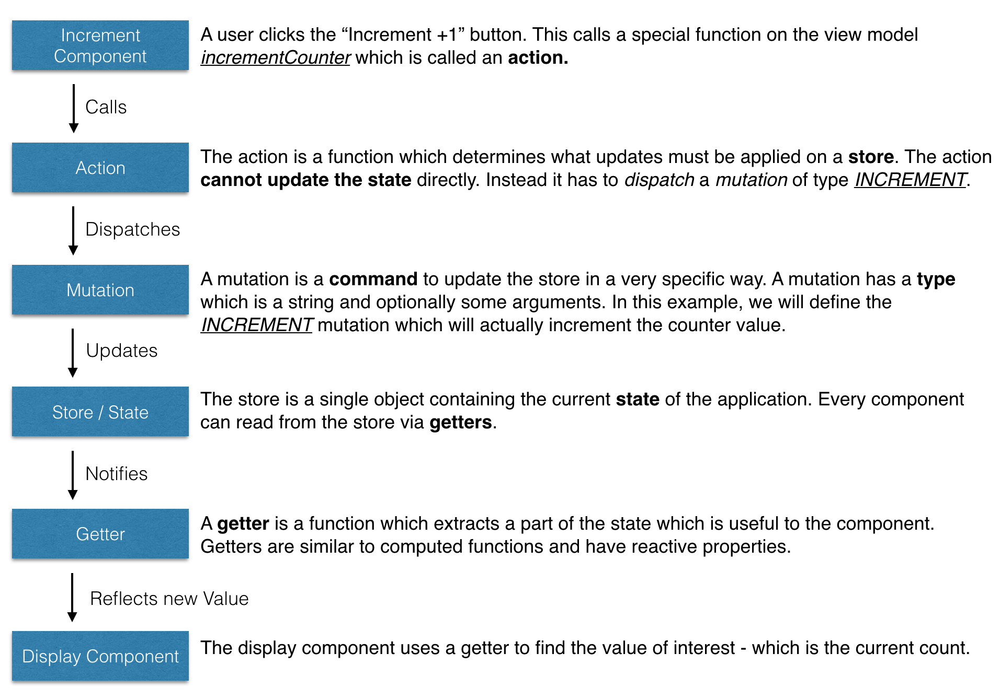

# Tutorial

Vamos a construir una aplicación muy sencilla utilizando Vuex para entender cómo usarlo. Para este ejemplo, estamos construyendo una aplicación en la que pulsas un botón, e incrementa un contador.


Estamos utilizando este sencillo ejemplo para explicar los conceptos y los problemas que Vuex pretende resolver - cómo manejar una gran aplicación que utiliza varios componentes. Considere si este ejemplo utiliza tres componentes:

### `components/App.vue`

El componente raíz, que contiene otros dos componentes hijos:

* `Display` para visualizar el valor actual del contador.
* `Increment` que es un botón para aumentar el valor actual.

```html
<template>
  <div>
    <Display></Display>
    <Increment></Increment>
  </div>
</template>

<script>

import Display from './Display.vue'
import Increment from './Increment.vue'

export default {
  components: {
    Display: Display,
    Increment: Increment
  }
}
</script>
```

### `components/Display.vue`

```html
<template>
  <div>
    <h3>Recuento es 0</h3>
  </div>
</template>

<script>
export default {
}
</script>
```

### `components/Increment.vue`

```html
<template>
  <div>
    <button>Incrementar +1</button>
  </div>
</template>

<script>
export default {
}
</script>
```

### Desafíos sin Vuex

* `Increment` y `Display` no son conscientes el uno del otro, y no pueden pasar mensajes entre sí.
* `App` tendrá que utilizar eventos y transmisiones para coordinar los dos componentes.
* Dado que `App` está coordinando entre los dos componentes, los mismos no son reutilizables y fuertemente acoplados. La reestructuración de la aplicación podría romperlo.

### El "flujo" de Vuex

Estos son los pasos que se llevan a cabo en orden:



Esto puede parecer un poco excesivo para incrementar un contador. Pero ten en cuenta que estos conceptos funcionan bien en aplicaciones de mayor tamaño, mejorando la mantenibilidad y haciendo la aplicación más fácil de depurar y mejorar a largo plazo. Así que vamos a modificar nuestro código para utilizar Vuex.

### Paso 1: Añadir un almacén

El almacén contiene los datos de la aplicación. Todos los componentes leen los datos del almacén. Antes de comenzar, instala Vuex a través del npm:

```
$ npm install --save vuex
```

Crea un nuevo archivo en `vuex/store.js`

```js
import Vue from 'vue'
import Vuex from 'vuex'

// Haz Vue consciente de Vuex
Vue.use(Vuex)

// Crea un objeto conteniendo el estado inicial
// para cuando la app es iniciada
const state = {
  // TODO: Configurar el estado inicial
}

// Crea un objeto almacenando varias mutaciones. Escribe la mutación
const mutations = {
  // TODO: Configura las mutaciones
}

// Combina el estado inicial y las mutaciones para crear un almacén Vuex
// Este almacén puede puede vincularse a nuestra app
export default new Vuex.Store({
  state,
  mutations
})
```

Tenemos que hacer que nuestra aplicación sea consciente de este almacén. Para ello simplemente tenemos que modificar nuestro componente raíz.

Edita `components/App.vue` y añade el almacén.

```js
import Display from './Display.vue'
import Increment from './IncrementButton.vue'
import store from '../vuex/store' // importa el almacén que acabamos de crear

export default {
  components: {
    Display: Display,
    Increment: Increment
  },
  store: store // hace que este y todos los componentes hijos sean conscientes del nuevo almacén
}
```

> **Consejo**: Con ES6 y babel puedes escribirlo como
>
>     components: {
>       Display,
>       Increment,
>     },
>     store

### Paso 2: Configurar la acción

La acción es una función que se llama desde el componente. Las funciones de acción pueden desencadenar cambios en el almacén despachando la mutación correcta. Una acción también puede hablar con backends HTTP y leer otros datos del almacén antes de despachar actualizaciones.

Crear un nuevo archivo en `vuex/actions.js` con una sola función `incrementCounter`.

```js
// Una acción recibirá el almacén como el primer argumento.
// Puesto que sólo estamos interesados en el despacho (y opcionalmente el estado)
// podemos tirar de esos dos parámetros con la función de desestructuración del ES6
export const incrementCounter = function ({ dispatch, state }) {
  dispatch('INCREMENT', 1)
}
```

Y vamos a llamar a la acción desde nuestro componente `components/Increment.vue`.

```html
<template>
  <div>
    <button @click='increment'>Incrementar +1</button>
  </div>
</template>

<script>
import { incrementCounter } from '../vuex/actions'
export default {
  vuex: {
    actions: {
      increment: incrementCounter
    }
  }
}
</script>
```

Notar algunas cosas interesantes acerca de lo que acabamos de añadir.

1. Tenemos un nuevo objeto `vuex.actions` que incluye la nueva acción.
2. No especificamos qué almacén, objeto, estado, etc. Vuex se encarga de todo por nosotros.
3. Podemos llamar la acción mediante `this.increment()` en cualquier método.
4. También podemos llamar la acción utilizando el parámetro `@click` haciendo de `increment` un método regular del componente.
5. La acción se llama `incrementCounter`, pero podemos utilizar cualquier nombre apropiado.

### Paso 3: Configura el estado y las mutaciones

En nuestro archivo `vuex/actions.js` despachamos la mutación `INCREMENT` pero no hemos escrito todavía cómo manejarla. Hagamos eso ahora.

Edita `vuex/store.js`.

```js
const state = {
  // Cuando la app es iniciada, count se establece en 0
  count: 0
}

const mutations = {
  // Una mutación recibe el estado actual como el primer argumento
  // Puedes hacer cualquier modificación que desees dentro de esta función
  INCREMENT (state, amount) {
    state.count = state.count + amount
  }
}
```

### Paso 4: Obtener el valor en el componente

Crea un nuevo archivo llamado `vuex/getters.js`.

```js
// Este captador es una función que solamente devuelve el recuento
// Con ES6 también puedes escribirlo como:
// export const getCount = state => state.count

export function getCount (state) {
  return state.count
}
```

Esta función devuelve parte del objeto de estado que es de interés - el recuento actual. Ahora podemos utilizar este captador dentro del componente.

Edita `components/Display.vue`

```html
<template>
  <div>
    <h3>Recuento es {{ counterValue }}</h3>
  </div>
</template>

<script>
import { getCount } from '../vuex/getters'
export default {
  vuex: {
    getters: {
      // notar que estás pasando la función en sí misma, y no el valor 'getCount()'
      counterValue: getCount
    }
  }
}
</script>
```

Hay un nuevo objeto `vuex.getters` que pide que `counterValue` esté ligado al captador `getCount`. Hemos elegido nombres diferentes para demostrar que se pueden utilizar nombres que tengan sentido en el contexto de tu componente, no necesariamente el nombre del captador en sí mismo.

Tal vez te estés preguntando - por qué hemos elegido utilizar un captador en lugar de acceder directamente el valor del estado. Este concepto es más bien una mejor práctica, y es más aplicable a una aplicación grande, que presenta varias distintivas ventajas:

1. Quizás nos interese definir obtenedores con valores computados (piensa en totales, promedios, etc.).
2. Muchos de los componentes en una aplicación más grande pueden usar la misma función del captador.
3. Si el valor se mueve de digamos `store.count` a `store.counter.value` tendrías que actualizar un captador en lugar de docenas de componentes.

Estos son algunos de los beneficios de usar obtenedores.

### Paso 5: Siguientes pasos

Si ejecutas la aplicación ahora, comprobarás que se comporta como se espera.

Para ampliar tu conocimiento de Vuex, puedes intentar implementar los siguientes cambios en la app, como un ejercicio.

* Agregar un botón de decremento.
* Instala [VueJS Devtools](https://chrome.google.com/webstore/detail/vuejs-devtools/nhdogjmejiglipccpnnnanhbledajbpd?hl=es) y juega con las herramientas Vuex y observa las mutaciones que están siendo aplicadas.
* Añade una entrada de texto en otro componente llamado `IncrementAmount` e introduce la cantidad que hay que sumar. Esto puede ser un poco complicado ya que los formulario en Vuex funcionan de forma ligeramente diferente. Lea la sección [Form Handling](forms.md) para más detalles.
