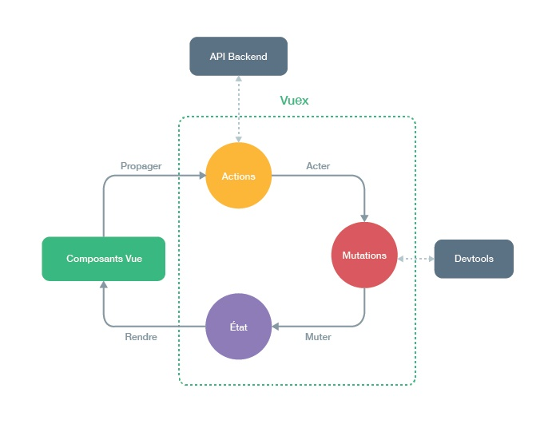

# Qu'est-ce que Vuex ?

Vuex est un ***state management pattern* et une bibliothèque** pour des applications Vue.js. Il sert de store centralisé pour tous les composants dans une application, avec des règles pour s'assurer que l'état ne peut subir des mutations que d'une manière prévisible. Il s'intègre également avec [l'extension officielle](https://github.com/vuejs/vue-devtools) de Vue afin de fournir des fonctionnalités avancées comme voir l'état dans le temps et débugger sans configuration, ainsi que de prendre des instantanés, importer et exporter l'état.

### Qu'est-ce qu'un "State Management Pattern"?

Commençons avec une simple application Vue de compteur :

``` js
new Vue({
  // state
  data () {
    return {
      count: 0
    }
  },
  // view
  template: `
    <div>{{ count }}</div>
  `,
  // actions
  methods: {
    increment () {
      this.count++
    }
  }
})
```

C'est une app auto-contenue avec les parties suivantes :

- L'**État** (_state_), qui est la source de vérité qui dirige notre app;
- La **Vue** (_view_), qui est juste un mapping déclaratif du **state**;
- Les **actions**, qui sont les façons possibles pour le state de changer en réaction aux actions de l'utilisateur depuis la **vue**.

Voici une représentation extrèmement simple du concept de "one-way data flow" (_flux de données unidirectionnel_) :

<p style="text-align: center; margin: 2em">
  
</p>

Cependant, la simplicité s'évapore rapidement lorsque nous avons **de multiples composants qui partagent le même state** :

- Plusieurs vues peuvent dépendre de la même partie du state.
- Des actions dans différentes vues peuvent avoir besoin de muter la même partie du state.

Pour le premier problème, passer des propriétés peut être fastidieux pour les composants profondément imbriqués, et ça ne fonctionne tout simplement pas pour les composants d'un même parent. Pour le deuxième problème, on se retrouve souvent à se rabattre sur des solutions telles qu'accéder aux références d'instance du parent/enfant direct ou essayer de muter et synchroniser de multiples copies du state via des events. Ces deux patterns sont fragiles et posent rapidement des problèmes de maintenabilité du code.

Alors pourquoi ne pas extraire le state partagé des composants, et le gérer dans un singleton global ? De cette manière, notre arbre de composant devient une grosse "view", et n'importe-quel composant peut accéder au state ou déclencher des actions, peu importe où il se trouve dans l'arbre !

De plus, en définissant et en séparant les concepts impliqués dans la gestion d'un state et en appliquant certaines règles, on donne aussi une structure et une maintenabilité à notre code.

Voilà l'idée de base derrière Vuex, inspiré par [Flux](https://facebook.github.io/flux/docs/overview.html), [Redux](http://redux.js.org/) et [l'Architecture Elm](https://guide.elm-lang.org/architecture/). À l'inverse des autres patterns, Vuex est aussi une bibliothèque d'implémentation conçue spécialement pour Vue.js afin de bénéficier de son système de réactivité granulaire pour des modifications efficaces.



### Quand l'utiliser ?

Bien que Vuex nous aide à gérer une state partagé, il apporte aussi le coût de nouveaux concepts et _boilerplate_. C'est un compromis entre la productivité à court terme et à long terme.

Si vous n'avez jamais créé une _Single Page Application_ à grande échelle et que vous sautez directement dans Vuex, cela peut paraître verbeux et intimidant. C'est parfaitement normal &mdash; si votre application est simple, vous vous en sortirez sans doute très bien sans Vuex. Un simple [bus d'event global](http://vuejs.org/guide/components.html#Non-Parent-Child-Communication) pourrait très bien vous suffire. Mais si vous devez créer une SPA à moyenne ou grande échelle, il y a des chances que vous vous trouviez dans des situations qui vous feront penser à une meilleure façon de gérer le state en-dehors de votre composant Vue, et Vuex sera naturellement la prochaine étape pour vous. Voici une bonne citation de Dan Abramov, l'auteur de Redux :

> Flux libraries are like glasses: you’ll know when you need them.
>
> _Les librairies Flux, c'est comme les lunettes : vous saurez quand vous en aurez besoin._
