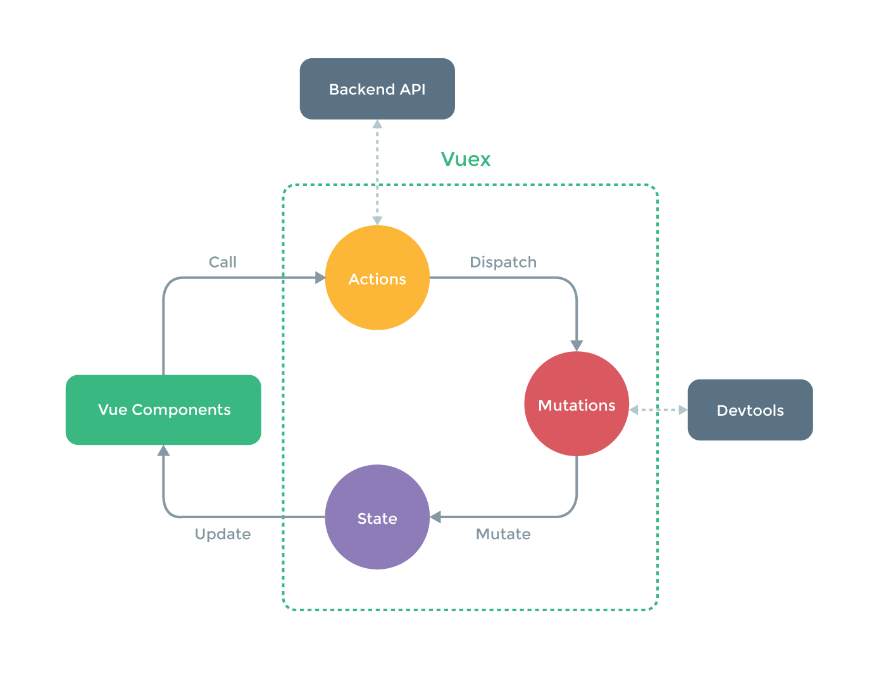

# Flusso dei Dati

Costruiamo un semplice contatore tramite Vuex per avere una visione migliore su come i dati siano scambiati tra i vari componenti. Si noti che questo esempio è un'estremizzazione per spiegare alcuni concetti chiavi, Vuex non è utile per questo tipo di applicazioni molto semplici.

### Lo Store

``` js
// store.js
import Vue from 'vue'
import Vuex from 'vuex'

Vue.use(Vuex)

// Stato iniziale della nostra applicazione
const state = {
  count: 0
}

// Definiamo tutte le mutazioni
const mutations = {
  INCREMENT (state) {
    state.count++
  },
  DECREMENT (state) {
    state.count--
  }
}

// creiamo lo store
export default new Vuex.Store({
  state,
  mutations
})
```

### Action

``` js
// actions.js
export const increment = ({ dispatch }) => dispatch('INCREMENT')
export const decrement = ({ dispatch }) => dispatch('DECREMENT')
```

### Utilizziamo Vue

**Il Template**

``` html
<div id="app">
  Hai Cliccato: {{ count }} volte
  <button v-on:click="increment">+</button>
  <button v-on:click="decrement">-</button>
</div>
```

**Lo Script**

``` js
// Stiamo importanto ed iniettando lo store perchè questo è il componente di root
// In un'applicazione grossa questo procedimento viene fatto una sola volta
import store from './store'
import { increment, decrement } from './actions'

const app = new Vue({
  el: '#app',
  store,
  vuex: {
    getters: {
      count: state => state.count
    },
    actions: {
      increment,
      decrement
    }
  }
})
```

Ecco fatto, questa applicazione è molto semplice e mostra come le action, mutazioni e lo store funzionino in modo tale da manipolare, anche se in questo caso molto banalmente, lo stato in base agli eventi che arrivano dal template, o utente.

Noterete anche che il flusso dei dati è unidirezionale, come dovrebbe esserlo in Flux:

1. L'utente sfrutta un componente per eseguire delle action;
2. Le action avvitano le mutazioni che cambiano lo stato;
3. Una volta che lo stato cambia una proprietà dello store, tale cambiamento viene riflesso ai componenti tramite i getter.

<p align="center">
  
</p>
