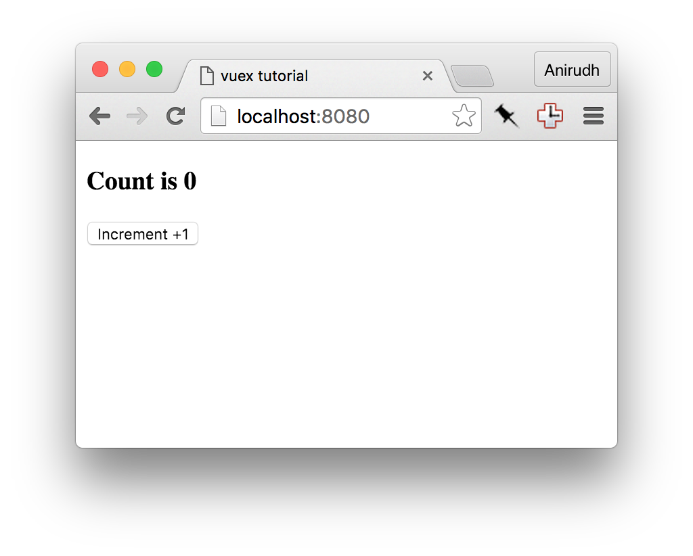

# チュートリアル

Vuex の使い方を理解するために、Vuex を使った非常に簡単なアプリケーションを作ってみましょう。次の例では、ボタンを押すとカウンターをインクリメントするアプリケーションを作ります。



この簡単な例を使って Vuex のコンセプトと、解決しようとしている課題（様々なコンポーネントを用いた大きなアプリケーションをどのように構築するか）を説明します。この例では以下の3つのコンポーネントが使われます。

### `components/App.vue`

これはルートとなるコンポーネントで、2つの子コンポーネントを持ちます。

* `Display` は現在のカウンターの値を表示します。
* `Increment` は現在の値をインクリメントするボタンです。

```html
<template>
  <div>
    <Display></Display>
    <Increment></Increment>
  </div>
</template>

<script>

import Display from './Display.vue'
import Increment from './Increment.vue'

export default {
  components: {
    Display: Display,
    Increment: Increment
  }
}
</script>
```

### `components/Display.vue`

```html
<template>
  <div>
    <h3>Count is 0</h3>
  </div>
</template>

<script>
export default {
}
</script>
```

### `components/Increment.vue`

```html
<template>
  <div>
    <button>Increment +1</button>
  </div>
</template>

<script>
export default {
}
</script>
```

### Vuex が無い場合の課題

* `Increment` と `Display` は互いに独立しているため、メッセージを送り合うことができません。
* `App` はこの2つのコンポーネントを協調させるため、イベントの橋渡しをする必要があるでしょう。
* `App` が2つのコンポーネントの橋渡しをしてしまうことで、コンポーネントが密結合してしまい、再利用できなくなってしまいます。アプリケーションの再構築によって壊れてしまうでしょう。

### Vuex の "フロー"

Vuex には以下の順で発生するステップがあります。


これはカウンターをインクリメントするには少しやり過ぎかもしれません。しかし、大きなアプリケーションではこれらのコンセプトが、保守性を高め、デバッグをしやすくし、長期間の改善をするために有効であることを頭に入れておいてください。それでは、Vuex を使ったコードに修正してみましょう。

### ステップ 1：ストアを追加する

ストアはアプリケーションのデータを保持します。すべてのコンポーネントはストアからデータを読みます。まずはじめに、npm から Vuex をインストールしましょう。

```
$ npm install --save vuex
```

新しく `vuex/store.js` ファイルを作ります。

```js
import Vue from 'vue'
import Vuex from 'vuex'

// Vuex を使うことを vue に知らせます。
Vue.use(Vuex)

// アプリケーションが起動した時のステート（初期状態）を
// 保持するためのオブジェクトを作ります。
const state = {
  // TODO: 初期状態を用意する
}

// 様々なミューテーションのためのオブジェクトを作ります。ミューテーションは後で書きます。
const mutations = {
  // TODO: ミューテーションを用意する
}

// 初期状態とミューテーションを結合し、Vuex のストアを作成します。
// このストアは私達のアプリケーションへつなげることができます。
export default new Vuex.Store({
  state,
  mutations
})
```

次に、アプリケーションとこのストアをつなげる必要があります。そのために、ルートのコンポーネントを少々修正する必要があります。

`components/App.vue` を編集し、ストアを追加しましょう。

```js
import Display from './Display.vue'
import Increment from './Increment.vue'
import store from '../vuex/store' // 作成したストアをインポートします。

export default {
  components: {
    Display: Display,
    Increment: Increment
  },
  store: store // このコンポーネントとすべての子孫コンポーネントからストアを使用できるようにします。
}
```

> **Tip**: ES6 および babel を使用していれば、以下のようにも書けます。
>
>     components: {
>       Display,
>       Increment,
>     },
>     store

### ステップ 2：アクションを用意する

アクションはコンポーネントから呼び出される関数です。アクション関数は対応するミューテーションをディスパッチすることで、ストアを更新することができます。アクションは更新をディスパッチする前に、その他のデータを読み込むために HTTP バックエンドと通信することも可能です。

`incrementCounter` 関数を持つ、新しいファイル `vuex/action.js` を作成しましょう。

```js
// アクションは1番目の引数にストアを受け取ります。
// 私達はディスパッチ（と時にはステートにも）のみに興味を持っているため、
// ES6 の分割束縛（destructuring）機能を使用して、これらの2つのパラメータを取得することもできます。
export const incrementCounter = function ({ dispatch, state }) {
  dispatch('INCREMENT', 1)
}
```

そして、 `components/Increment.vue` コンポーネントからこのアクションを呼び出しましょう。

```html
<template>
  <div>
    <button @click='increment'>Increment +1</button>
  </div>
</template>

<script>
import { incrementCounter } from '../vuex/actions'
export default {
  vuex: {
    actions: {
      increment: incrementCounter
    }
  }
}
</script>
```

上の例で追加されたものについての興味深い事実を説明します。

1. 新しいアクションを加えるための `vuex.actions` という新しいオブジェクトを定義しています。
2. ストア、オブジェクト、ステートなどを明示していません。 Vuex がこれらすべてをつなげてくれます。
3. どのメソッド内でも `this.increment()` と書くことでアクションを呼び出すことができます。
4. 通常の Vue コンポーネントのメソッドのように、 `@click` パラメーターに `increment` を指定することでもアクションを呼び出すことができます。
5. ここでのアクションは `incrementCounter` と名付けましたが、任意の適切な名前をつけることができます。

### ステップ 3：ステートとミューテーションを用意する

`vuex/actions.js` ファイル内では `INCREMENT` ミューテーションをディスパッチしていますが、まだそれをどのように処理するかは書かれていません。次はそれを書きましょう。

`vuex/store.js` を編集します。

```js
const state = {
  // アプリケーションがスタートする時、カウントが 0 にセットされます。
  count: 0
}

const mutations = {
  // ミューテーションは現在のステートを1番目の引数に受け取ります。
  // この関数内では任意の更新を行うことができます。
  INCREMENT (state, amount) {
    state.count = state.count + amount
  }
}
```

### ステップ 4：コンポーネントへ値を渡す

`vuex/getters.js` という名前の新しいファイルを作ります。

```js
// このゲッターはただカウントを返すだけの関数です。
// ES6 では以下のようにも書けます。
// export const getCount = state => state.count

export function getCount (state) {
  return state.count
}
```

この関数は、現在のカウントのような、関心を持っているステートオブジェクトの一部を返します。これにより、コンポーネント内でこのゲッターを使用することができます。

`components/Display.vue` を編集します。

```html
<template>
  <div>
    <h3>Count is {{ counterValue }}</h3>
  </div>
</template>

<script>
import { getCount } from '../vuex/getters'
export default {
  vuex: {
    getters: {
      // `getCount()` のような値を渡すのではなく、関数自身を渡すことに注意してください
      counterValue: getCount
    }
  }
}
</script>
```

新しいオブジェクト `vuex.getters` が追加され、 `getCount` ゲッターへと束縛される `counterValue` を定義しています。ゲッター自身の名前と同じにする必要はありません。この例では、コンポーネントの文脈で意味のある名前を使えるということを示すために異なる名前を使用しています。

あなたはおそらく、なぜ直接ステートの値にアクセスせずにゲッターを使用するのか不思議に思っていることでしょう。このコンセプトはベストプラクティスであり、大きなアプリケーションにより適しています。これは以下のように明確な複数の利点があります。

1. 計算後の値をとりだすゲッターを定義したい場合があるでしょう（たとえば、合計、平均、など）。
2. 大きなアプリケーション内の多くのコンポーネントは同一のゲッター関数を使用することができます。
3. もし値が `store.count` から `store.coutner.value` に変わった時、多数のコンポーネントを書き換えるのではなく、ただ1つのゲッターを更新するだけですみます。

### ステップ 5：次のステップ

このアプリケーションを実行すると、期待した通りに動くことを確認できるでしょう。

Vuex の理解をより深めるため、演習として、次の変更をこのアプリケーションに実装してみると良いでしょう。

* デクリメントボタンを追加してみましょう。
* [VueJS Devtools](https://chrome.google.com/webstore/detail/vuejs-devtools/nhdogjmejiglipccpnnnanhbledajbpd?hl=ja) をインストールし、 Vuex のツールとともに実行し、適用されるミューテーションを見てみましょう。
* テキスト入力を持つ `IncrementAmount` という名前のコンポーネントを追加し、インクリメントする数を入力できるようにしましょう。これは、Vuex のフォームが少々異なる動作をするため、少しトリッキーです。より詳細については[フォームハンドリング](forms.md)の節を読んでください。
