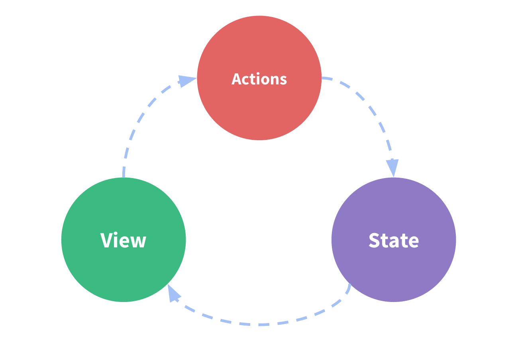

# O que é Vuex?

O Vuex é um ** padrão de gerenciamento de estado + biblioteca ** para aplicativos Vue.js. Ele serve como uma loja centralizada para todos os componentes em uma aplicação, com regras garantindo que o estado só possa ser mutado de forma previsível.
Ele também se integra com a versão [devtools extension](https://github.com/vuejs/vue-devtools) do Vue para fornecer recursos avançados, como depuração de tempo-viagem de zero-config e exportação / importação de instantâneo de estado.

### O que é um "Padrão de Gerenciamento do Estado"?

Vamos começar com um simples aplicativo de contador Vue:

``` js
new Vue({
  // state
  data () {
    return {
      count: 0
    }
  },
  // view
  template: `
    <div>{{ count }}</div>
  `,
  // actions
  methods: {
    increment () {
      this.count++
    }
  }
})
```

É um aplicativo autônomo com as seguintes partes:

- O ** state **, que é a fonte da verdade que impulsiona nosso aplicativo;
- A ** view **, que é apenas um mapeamento declarativo do ** estado **;
- As ** actions **, que são as possíveis maneiras pelas quais o estado pode mudar em reação às entradas de usuários da ** view **.

Esta é uma representação extremamente simples do conceito de "fluxo de dados unidirecional":
<p style="text-align: center; margin: 2em">
  
</p>

No entanto, a simplicidade rapidamente se quebra quando temos ** múltiplos componentes que compartilham o estado comum **:

- Várias visualizações podem depender da mesma parte do estado.

- As ações de diferentes views podem precisar mutar a mesma parte de estado
Para o problema um, passar propriedades pode ser tediosos para componentes profundamente aninhados e simplesmente não funcionam para componentes irmãos. Para o problema dois, muitas vezes nos encontramos recorrendo a soluções como a busca de referências diretas de instâncias pai / filho ou tentando mutar e sincronizar múltiplas cópias do estado através de eventos. Ambos esses padrões são frágeis e rapidamente levam a um código não sustentável.

Então, por que não extraímos o estado compartilhado dos componentes e gerenciamos isso em um singleton global? Com isso, nossa árvore de componentes se torna uma grande "view", e qualquer componente pode acessar o estado ou ações de trigger, não importa onde eles estão na árvore!

Além disso, definindo e separando os conceitos envolvidos na gestão do estado e aplicando certas regras, também damos ao nosso código mais estrutura e capacidade de manutenção.

Esta é a idéia básica por trás do Vuex, inspirada por
 [Flux](https://facebook.github.io/flux/docs/overview.html), [Redux](http://redux.js.org/) e [The Elm Architecture](https://guide.elm-lang.org/architecture/). Ao contrário dos outros padrões, o Vuex também é uma implementação de biblioteca adaptada especificamente para Vue.js para aproveitar seu sistema de reatividade granular para atualizações eficientes.


### Quando devo usar-lo?

Embora o Vuex nos ajude a lidar com gerenciamento de estado compartilhado, ele também vem com o custo de mais conceitos e relatórios. É um trade-off entre produtividade a curto prazo e longo prazo.

Se você nunca construiu um SPA de grande escala e pulando direito para o Vuex, pode parecer detalhista e assustador. Isso é perfeitamente normal - se o seu aplicativo for simples, você provavelmente estará bem sem o Vuex. Um simples [global event bus](https://br.vuejs.org/v2/guide/components.html#Comunicacao-Nao-Pai-Filho) pode ser tudo o que você precisa. Mas se você estiver construindo um SPA de médio a grande escala, é provável que você tenha encontrado situações que o façam pensar sobre como lidar melhor com o estado fora dos componentes do Vue e o Vuex será o próximo passo natural para você. Há uma boa citação de Dan Abramov, o autor da Redux:

> As bibliotecas Flux são como óculos: você saberá quando você precisar deles.


