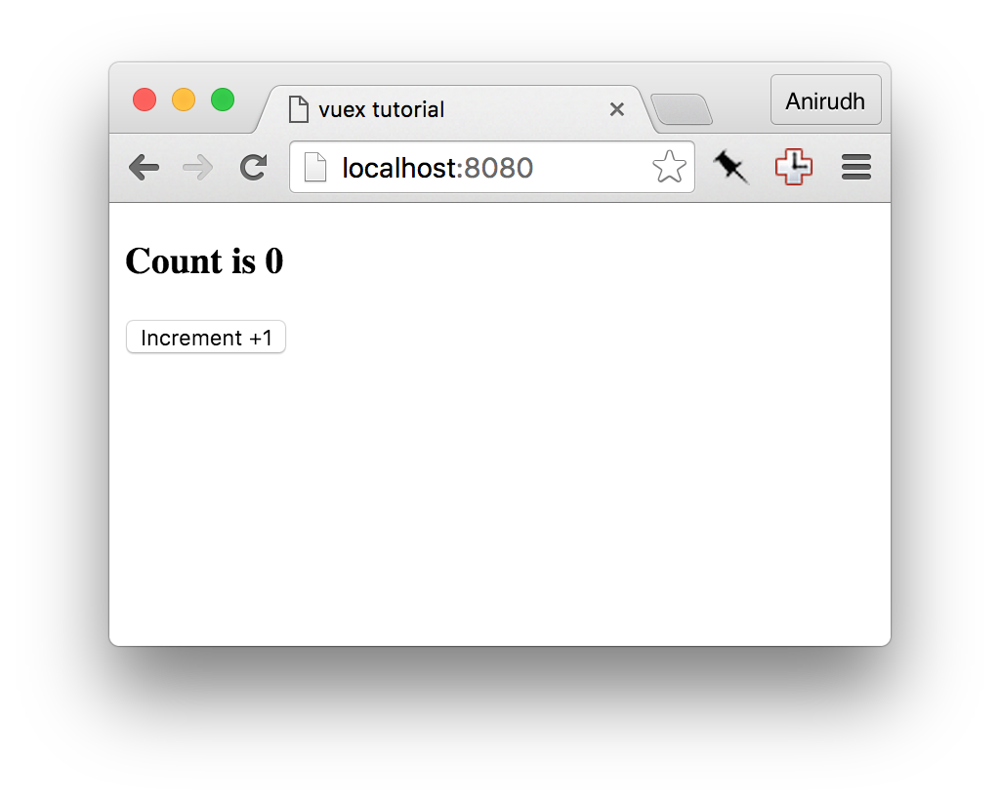

# Tutorial

 Vamos criar um app bem simples utilizando o Vuex para entender como utilizá-lo. Para esse exemplo, nós iremos construir um aplicativo onde você pressiona um botão, e ele incrementa um contador.



Nós estaremos utilizando esse simples exemplo para explicar os conceitos, e os problemas que o vuex tenta resolver - como gerenciar um aplicativo complexo que utiliza vários componentes. Considere que esse exemplo utiliza três componentes:

### `components/App.vue`

O elemento raíz, que contém outros dois componentes filhos:

* `Display` para exibir o valor atual do contador.
* `Increment` que é um botão para incrementar o valor atual.

```html
<template>
  <div>
    <Display></Display>
    <Increment></Increment>
  </div>
</template>

<script>

import Display from './Display.vue'
import Increment from './Increment.vue'

export default {
  components: {
    Display: Display,
    Increment: Increment
  }
}
</script>
```

### `components/Display.vue`

```html
<template>
  <div>
    <h3>Count is 0</h3>
  </div>
</template>

<script>
export default {
}
</script>
```

### `components/Increment.vue`

```html
<template>
  <div>
    <button>Increment +1</button>
  </div>
</template>

<script>
export default {
}
</script>
```

### Desafios sem o vuex

* `Increment` e `Display` não sabem da existência um do outro, e não podem passar mensagens entre si.
* `App` terá que utilizar <i>events</i> e <i>broadcasts</i> para coordenar os dois componentes.
* Já que o `App` é quem coordena os outros componentes, eles não são reutilizáveis e são muito acoplados. Reestruturar o aplicativo pode quebrá-lo.

### "Fluxo" Vuex

Esses são os passos que serão utilizados:


Isso pode ser um pouco demais para incrementar um contador. Mas note que esses conceitos irão funcionar muito bem em aplicações maiores, melhorando a manutenabilidade e fazendo seu aplicativo mais fácil de debugar e vai te ajudar a manter ele por mais tempo. Então, vamos modificar nosso código para utilizar o Vuex.

### Passo 1: Adicione um Armazém

O armazém mantém os dados do aplicativo. Todos os componentes utilizam os dados do armazém. Antes de começarmos, instale o Vuex via npm:

```
$ npm install --save vuex
```

Crie um novo arquivo em `vuex/store.js`

```js
import Vue from 'vue'
import Vuex from 'vuex'

// Indique o Vue a utilizar o Vuex
Vue.use(Vuex)

// Nós criamos um objeto para armazenar o valor inicial do estado
// quando o aplicativo for iniciado
const state = {
  // TODO: Adicionar o estado inicial
}

// Crie um objeto para armazenar nossas mutações.
const mutations = {
  // TODO: adicionar as mutações
}

// Vamos combinar o estado inicial com as mutações para criar um armazém Vuex
// Esse armazém pode ser vinculado ao aplicativo
export default new Vuex.Store({
  state,
  mutations
})
```

Nós precisamos informar ao nosso aplicativo sobre esse armazém. Para fazer isso nós simplesmente precisamos alterar nosso componente principal.

Edite o arquivo `components/App.vue` e adicione o armazém.

```js
import Display from './Display.vue'
import Increment from './IncrementButton.vue'
import store from '../vuex/store' // importe o armazém que acabamos de criar

export default {
  components: {
    Display: Display,
    Increment: Increment
  },
  store: store // Adicionando essa linha todos os componentes filhos saberão da existência do armazém
}
```

> **Dica**: Com ES6 e Babel você pode utilizar da seguinte maneira:
>
>     components: {
>       Display,
>       Increment,
>     },
>     store

### Passo 2: Crie as ações

A ação é uma função que é chamada no componente. Funções de ação pode disparar atualizações no armazém ao disparar a mutação correta. Uma ação também pode fazer requisições HTTP e ler outros dados do armazém antes de disparar atualizações.

Crie um novo arquivo em `vuex/actions.js` com uma simples função chamada `incrementCounter`

```js
// Uma ação irá receber um armazém como seu primeiro argumento
// Já que estamos apenas interessados em disparar uma mutação
// Nós podemos importar os dois parâmetros utilizando a habilidade de <i>destructuring</i> do ES6
export const incrementCounter = function ({ dispatch, state }) {
  dispatch('INCREMENT', 1)
}
```

E vamos chamar a ação no nosso componente `components/Increment.vue`.

```
<template>
  <div>
    <button @click='increment'>Increment +1</button>
  </div>
</template>

<script>
import { incrementCounter } from '../vuex/actions'
export default {
  vuex: {
    actions: {
      increment: incrementCounter
    }
  }
}
</script>
```

Note algumas coisas interessantes que acabamos de adicionar:

1. Nós temos um novo objeto chamado `vuex.actions` que inclui a nova ação
2. Nós não especificamos qual armazém, objeto, estado e etc. O Vuex configura tudo por nós.
3. Nós podemos chamar a ação chamando `this.increment()` em qualquer método.
4. Nós podemos também chamar a ação utilizando passando de parâmetro a um evento `@click`, fazendo com que a ação `increment` atue como qualquer outro método Vue.
5. A ação é chamada `incrementCounter`, mas nós podemos utilizar o nome que acharmos mais apropriado.

### Passo 3: Configure o estado e a mutação

No nosso arquivo `vuex/actions.js` nós disparamos uma mutação `INCREMENT` mas nós ainda não escrevemos como lidar com isso. Então vamos fazer isso agora.

Edite o arquivo `vuex/store.js`

```js
const state = {
  // Quando o aplicativo iniciar, o valor de count será 0
  count: 0
}

const mutations = {
  // Uma mutação recebe o estado atual como primeiro parâmetro
  // Você pode fazer qualquer modificação dentro desse método
  INCREMENT (state, amount) {
    state.count = state.count + amount
  }
}
```

### Passo 4: Adicione o valor ao componente

Crie um novo arquivo chamado `vuex/getters.js`

```js
// Esse getter é uma função que simplesmente retorna o valor do contador
// Com o ES6 você pode escrever assim:
// export const getCount = state => state.count

export function getCount (state) {
  return state.count
}
```

Essa função retorna parte do objeto de estado que nos interessa - o valor atual do contador. Nós podemos utilizar esse getter dentro do componente.

Edite o arquivo `components/Display.vue`

```html
<template>
  <div>
    <h3>Count is {{ counterValue }}</h3>
  </div>
</template>

<script>
import { getCount } from '../vuex/getters'
export default {
  vuex: {
    getters: {
      // note que você está passando uma função, e não o valor 'getCount()'
      counterValue: getCount
    }
  }
}
</script>
```

Existe um novo objeto chamado `vuex.getters` que requisita a função `counterValue` para ser vinculada ao getter `getCount`. Nós escolhemos diferentes nomes para mostrar que você pode escolher o nome que fizer sentido ao contexto do seu componente, não necessariamente o nome do getter.

Você deve estar se perguntando - por que nós escolhemos utilizar um getter ao invés de acessar diretamente o valor do estado. Esse conceito é mais uma boa prática, e é mais aplicável a uma aplicação mais complexa, e apresenta algumas vantagens:

1. Nós podemos querer definir getters com valores computados (pense em totais, médias, etc.).
2. Muitos componentes em um aplicativo mais complexo utilizam o mesmo getter.
3. Se o valor for modificado, vamos dizer de `store.count` para `store.counter.value` você só precisa atualizar um getter ao invés de vários arquivos.

Esses são apenas alguns dos benefícios de utilizar os getters.

### Passo 5: Próximos Passos

Se você rodar a aplicação, agora você verá ela funcionando como deveria.

Para aumentar seu entendimento sobre o Vuex, você pode tentar implementar as seguintes modificações ao app, como um exercício.

* Adicione um botão de decremento.
* Instale o [Devtools do VueJS](https://chrome.google.com/webstore/detail/vuejs-devtools/nhdogjmejiglipccpnnnanhbledajbpd?hl=en) e explore as ferramentas do Vuex e observe as mutações sendo aplicadas.
* Adicione um input do tipo texto em outro componente chamado `IncrementAmount` e entre com um valor para incrementar o contador. Isso pode ser um pouco diferente, já que os forms no Vuex funcionam de uma forma diferente. Leia o arquivo [Manipulações de Formulários](forms.md) para mais detalhes.

