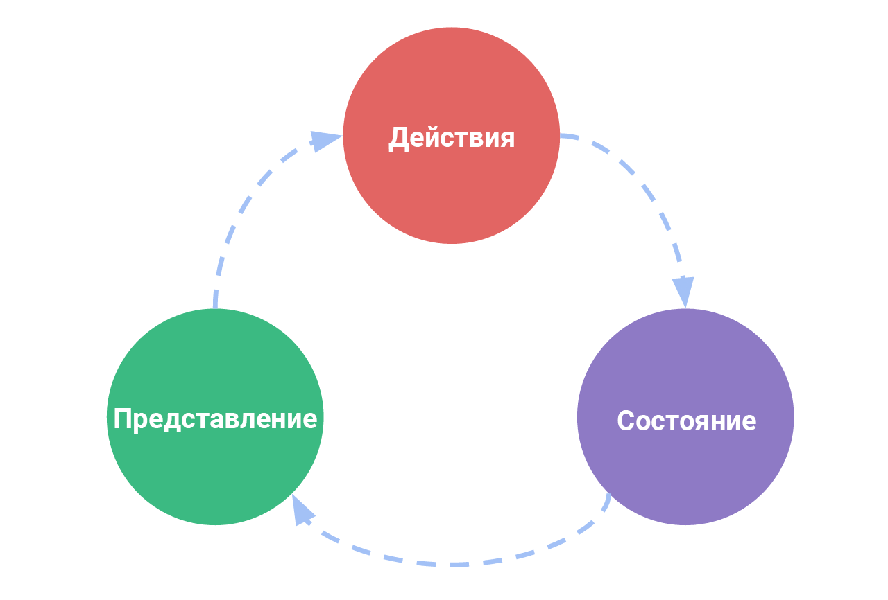
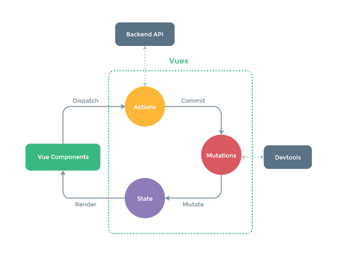

# Что такое Vuex?

Vuex - это **паттерн управления состоянием + библиотека** для приложений на Vue.js. Он служит централизованным хранилищем данных для всех используемых в приложении компонентов, при помощи определённых правил обеспечивая предсказуемость изменения данных. Кроме того, Vuex интегрируется с официальным [расширением инструментов разработчика](https://github.com/vuejs/vue-devtools) Vue, предоставляя "из коробки" такие продвинутые возможности как "машину времени" при отладке и экспорт/импорт слепков состояния данных.

### Что такое "Паттерн Управления Состоянием"?

Давайте начнём с простого приложения, реализующего счётчик с использованием Vue:

``` js
new Vue({
  // состояние
  data () {
    return {
      count: 0
    }
  },
  // представление
  template: `
    <div>{{ count }}</div>
  `,
  // действия
  methods: {
    increment () {
      this.count++
    }
  }
})
```

Это самостоятельное приложение может быть рассмотрено как совокупность следующих частей:

- **Состояние**, являющееся "источником истины", управляющим приложением;
- **Представление**, являющееся всего лишь декларативным отображением **состояния**;
- **Действия**, определяющие возможные пути изменения состояния, в ответ на действия пользователя в **представлении**.

Вот простейшее представление концепции "однонаправленного потока данных":

<p style="text-align: center; margin: 2em">
  
</p>

Простота, к сожалению, быстро исчезает при появлении **нескольких компонентов, основывающихся на одном и том же состоянии**, когда:

- Несколько представлений могут зависеть от одной и той же части состояния приложения
- Действия из разных представлений могут оказывать влияние на одни и те же части состояния приложения

В рамках решения первой проблемы, передача входных параметров в глубоко вложенные компоненты может стать утомительной, а для соседних компонентов — и вовсе не помочь. Решая вторую проблему, мы нередко обнаруживаем себя прибегающими к таким средствам как обращение к прямым родителям/потомкам компонента, или в попытках внести изменения и затем синхронизировать эти изменения с другими местами в приложении, используя события. Оба подхода хрупки и быстро приводят к появлению кода, который невозможно поддерживать.

Так почему бы не вынести всё общее состояние приложения из компонентов в глобальный синглтон? При использовании этого подхода, дерево компонентов превращается в одно большое "представление", а каждый компонент получает доступ к состоянию приложения, наряду с возможностью вызывать действия для изменения состояния, независимо от расположения этого компонента в дереве.

Кроме того, чётко определяя и разделяя концепции, возникающиее при управлении состоянием, и требуя соблюдения некоторых правил, мы улучшаем структурированность и поддерживаемость нашего кода.

Такова основная идея, лежащая в основе Vuex, вдохновлённого [Flux](https://facebook.github.io/flux/docs/overview.html), [Redux](http://redux.js.org/) и [Архитектурой Elm](https://guide.elm-lang.org/architecture/). В отличии от других паттернов, Vuex представляет собой также и реализацию в виде библиотеки, специально заточенной на использование совместно с Vue.js, и позволяющей использовать все преимущества его производительной системы реактивных обновлений.



### В Каких Случаях Следует Использовать Vuex?

Хотя Vuex и помогает управлять совместно используемым состоянием, ценой этой возможности является привнесение новых концепций и вспомогательного кода. Имеет место сделка между кратковременной и долгосрочной продуктивностью.

Если вам ещё не доводилось создавать крупномасштабные одностраничные приложения, Vuex может показаться многословным и обескураживающим. Это нормально — простые приложения вполне могут обойтись и без Vuex. Возможно, вполне достаточно будет использования [глобальной шины событий](http://vuejs.org/guide/components.html#Non-Parent-Child-Communication). Но если вы создаёте SPA среднего или крупного размера, вероятно вам уже приходилось сталкиваться с ситуациями, заставляющими задуматься о методах более эффективного управления состоянием приложения за пределами компонентов Vue, и Vuex в таком случае может оказаться вполне естественным следующим шагом. Есть неплохая цитата от Дэна Абрамова, автора Redux:

> Flux-библиотеки подобны очкам: если они вам действительно нужны, вы на этот счёт не сомневаетесь.